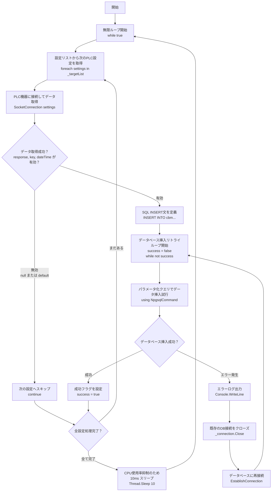

# Run メソッドのフローチャート

以下は `void Run()` メソッドの処理フローを表すMermaidフローチャートです。

## 処理の概要

このフローチャートは以下の主要な処理を表現しています：

### 1. メインループ
- アプリケーションは無限ループで動作
- 各サイクルで全てのPLC設定を順次処理

### 2. データ取得処理
- 各PLC設定に対してSocketConnectionメソッドを呼び出し
- TCP/UDP通信でPLC機器からデータを取得
- データ取得に失敗した場合は次の設定にスキップ

### 3. データベース保存処理
- 取得したデータをPostgreSQLデータベースに保存
- パラメータ化クエリを使用してSQLインジェクション攻撃を防止
- データベースエラー発生時は自動的に再接続を試行

### 4. エラーハンドリング
- ソケット通信エラーは個別に処理（次の設定へ続行）
- データベースエラーは接続の再確立で対応
- 全ての例外は適切にログ出力

### 5. パフォーマンス最適化
- 各サイクル後に10msのスリープでCPU使用率を制御
- リソースの適切な解放（usingステートメント使用）

このアーキテクチャにより、システムは高い可用性と安定性を維持しながら、複数のPLC機器から継続的にデータを収集できます。