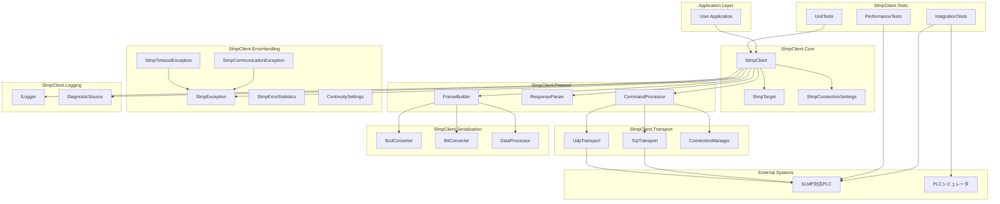
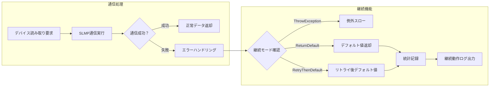
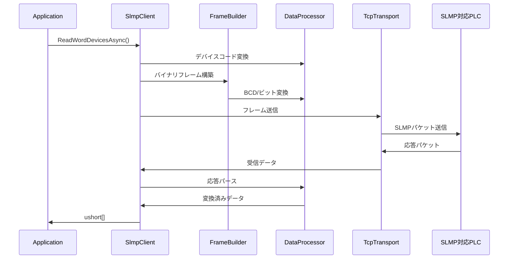
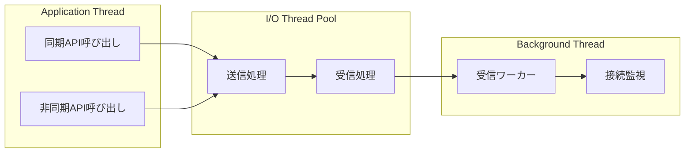

# アーキテクチャ概要図とトレーサビリティマトリクス

## アーキテクチャ概要

### システム全体構成図

### レイヤー構成詳細

#### Core Layer (SlmpClient.Core)
**責務**: 公開API、設定管理、オブジェクトライフサイクル
- `SlmpClient`: メインクライアントクラス、全機能の統合点
- `SlmpTarget`: 通信対象設定（ネットワーク、ノード等）
- `SlmpConnectionSettings`: 接続設定（ポート、プロトコル等）

#### Protocol Layer (SlmpClient.Protocol)
**責務**: SLMPプロトコル処理、フレーム構築・解析
- `FrameBuilder`: 3E/4E、Binary/ASCIIフレーム構築
- `ResponseParser`: 応答フレーム解析、エラーコード処理
- `CommandProcessor`: コマンド別処理ロジック

#### Transport Layer (SlmpClient.Transport)
**責務**: ネットワーク通信、接続管理
- `TcpTransport`: TCP通信実装
- `UdpTransport`: UDP通信実装
- `ConnectionManager`: 接続状態管理、再接続ロジック

#### Serialization Layer (SlmpClient.Serialization)
**責務**: データ変換、エンコーディング
- `BcdConverter`: 4bit BCD変換
- `BitConverter`: ビットパッキング/アンパッキング
- `DataProcessor`: デバイス表記、エンディアン変換

#### Error Handling Layer (SlmpClient.ErrorHandling)
**責務**: 例外定義、エラー分類、製造業向け継続機能
- `SlmpException`: 基底例外クラス
- `SlmpCommunicationException`: 通信エラー
- `SlmpTimeoutException`: タイムアウトエラー
- `SlmpErrorStatistics`: エラー統計・通知制御
- `SlmpContinuitySettings`: 稼働第一継続設定

#### Logging Layer (SlmpClient.Logging)
**責務**: ログ出力、診断情報
- `ILogger<T>`: 構造化ログ
- `DiagnosticSource`: パフォーマンス計測

#### Tests Layer (SlmpClient.Tests)
**責務**: 品質保証、性能測定
- `UnitTests`: 単体テスト
- `IntegrationTests`: 統合テスト
- `PerformanceTests`: 性能テスト

### 製造業向け継続機能アーキテクチャ

#### 稼働第一継続機能の概要
製造現場では通信エラーが発生してもシステムを停止させることなく、デフォルト値を返却して製造ラインの稼働を継続することが重要です。本実装では以下の継続機能を提供します：

#### 継続機能の動作モード
1. **ThrowException**: 従来通り例外をスロー（デフォルト）
2. **ReturnDefaultAndContinue**: エラー時にデフォルト値を返却してシステム継続
3. **RetryThenDefault**: リトライ後、失敗時はデフォルト値返却

#### エラー統計機能
- **操作回数記録**: 総操作数、エラー数、継続動作数の統計
- **エラー分類**: 通信エラー、タイムアウト、予期しないエラーの分類記録
- **通知制御**: エラー発生頻度制御（同一エラーの重複通知抑制）
- **サマリー出力**: エラー率、継続率、主要エラー一覧の提供

### データフロー図

### スレッドモデル

## トレーサビリティマトリクス

### Python → C# モジュール対応

| Python Module | C# Namespace | 責務 | 移植状況 |
|---------------|--------------|------|----------|
| `pyslmpclient.__init__` | `SlmpClient.Core` | メインクライアント | ✅ 設計完了 |
| `pyslmpclient.const` | `SlmpClient.Constants` | 定数・列挙型 | ✅ 設計完了 |
| `pyslmpclient.util` | `SlmpClient.Serialization` | データ変換 | ✅ 設計完了 |
| `tests.test_main` | `SlmpClient.Tests.Unit` | 単体テスト | 🔄 設計中 |
| `tests.test_util` | `SlmpClient.Tests.Serialization` | ユーティリティテスト | 🔄 設計中 |

### 関数/メソッド対応マトリクス

| Python関数 | C#メソッド | テストケースID | 実装優先度 |
|------------|------------|---------------|------------|
| `SLMPClient.__init__()` | `SlmpClient.ctor()` | TC001-005 | P1 |
| `SLMPClient.open()` | `SlmpClient.OpenAsync()` | TC006-010 | P1 |
| `SLMPClient.close()` | `SlmpClient.CloseAsync()` | TC011-015 | P1 |
| `SLMPClient.read_bit_devices()` | `SlmpClient.ReadBitDevicesAsync()` | TC016-030 | P1 |
| `SLMPClient.read_word_devices()` | `SlmpClient.ReadWordDevicesAsync()` | TC031-045 | P1 |
| `SLMPClient.write_bit_devices()` | `SlmpClient.WriteBitDevicesAsync()` | TC046-060 | P1 |
| `SLMPClient.write_word_devices()` | `SlmpClient.WriteWordDevicesAsync()` | TC061-075 | P1 |
| `SLMPClient.read_random_devices()` | `SlmpClient.ReadRandomDevicesAsync()` | TC076-090 | P2 |
| `SLMPClient.write_random_bit_devices()` | `SlmpClient.WriteRandomBitDevicesAsync()` | TC091-105 | P2 |
| `SLMPClient.write_random_word_devices()` | `SlmpClient.WriteRandomWordDevicesAsync()` | TC106-120 | P2 |
| `SLMPClient.entry_monitor_device()` | `SlmpClient.EntryMonitorDeviceAsync()` | TC121-135 | P2 |
| `SLMPClient.execute_monitor()` | `SlmpClient.ExecuteMonitorAsync()` | TC136-150 | P2 |
| `SLMPClient.read_block()` | `SlmpClient.ReadBlockAsync()` | TC151-165 | P2 |
| `SLMPClient.write_block()` | `SlmpClient.WriteBlockAsync()` | TC166-180 | P2 |
| `SLMPClient.read_type_name()` | `SlmpClient.ReadTypeNameAsync()` | TC181-190 | P3 |
| `SLMPClient.self_test()` | `SlmpClient.SelfTestAsync()` | TC191-200 | P3 |
| `SLMPClient.clear_error()` | `SlmpClient.ClearErrorAsync()` | TC201-210 | P3 |
| `SLMPClient.check_on_demand_data()` | `SlmpClient.CheckOnDemandData()` | TC211-220 | P3 |
| `SLMPClient.memory_read()` | `SlmpClient.MemoryReadAsync()` | TC221-230 | P3 |
| `SLMPClient.memory_write()` | `SlmpClient.MemoryWriteAsync()` | TC231-240 | P3 |

### ユーティリティ関数対応

| Python関数 | C#メソッド | テストケースID | 実装優先度 |
|------------|------------|---------------|------------|
| `util.encode_bcd()` | `BcdConverter.Encode()` | TC301-310 | P1 |
| `util.decode_bcd()` | `BcdConverter.Decode()` | TC311-320 | P1 |
| `util.unpack_bits()` | `BitConverter.UnpackBits()` | TC321-330 | P1 |
| `util.pack_bits()` | `BitConverter.PackBits()` | TC331-340 | P1 |
| `util.make_binary_frame()` | `FrameBuilder.BuildBinaryFrame()` | TC341-350 | P1 |
| `util.make_ascii_frame()` | `FrameBuilder.BuildAsciiFrame()` | TC351-360 | P1 |
| `util.str2bytes_buf()` | `DataProcessor.StringToBytesBuffer()` | TC361-370 | P2 |
| `util.extracts_word_dword_data()` | `DataProcessor.ExtractWordDwordData()` | TC371-380 | P2 |
| `util.device2ascii()` | `DataProcessor.DeviceToAscii()` | TC381-390 | P2 |

### 定数・列挙型対応

| Python定数 | C#列挙型 | テストケースID | 要素数 |
|------------|----------|---------------|--------|
| `const.SLMPCommand` | `SlmpCommand` | TC401-420 | 118 |
| `const.DeviceCode` | `DeviceCode` | TC421-440 | 39 |
| `const.TypeCode` | `TypeCode` | TC441-460 | 61 |
| `const.EndCode` | `EndCode` | TC461-480 | 39 |
| `const.PDU` | `Pdu` | TC481-490 | 21 |

### 例外処理対応

| Python例外 | C#例外 | テストケースID | 発生条件 |
|------------|--------|---------------|----------|
| `SLMPError` | `SlmpException` | TC501-510 | 基底例外 |
| `SLMPCommunicationError` | `SlmpCommunicationException` | TC511-520 | 通信エラー |
| `TimeoutError` | `SlmpTimeoutException` | TC521-530 | タイムアウト |
| `ValueError` | `ArgumentException` | TC531-540 | 引数エラー |
| `RuntimeError` | `InvalidOperationException` | TC541-550 | 状態エラー |

### テストカバレッジマトリクス

| 機能分類 | テストケース範囲 | カバレッジ目標 | 備考 |
|----------|------------------|---------------|------|
| 基本接続 | TC001-050 | 95% | 接続・認証・切断 |
| デバイスアクセス | TC051-200 | 95% | 読み書き・ランダムアクセス |
| システム機能 | TC201-300 | 90% | 型名取得・セルフテスト等 |
| データ変換 | TC301-400 | 98% | BCD・ビット変換 |
| 定数・列挙型 | TC401-500 | 100% | 全要素の検証 |
| 例外処理 | TC501-600 | 90% | 異常系・境界値 |

### 実装進捗追跡

| フェーズ | 対象範囲 | 完了基準 | 期限目安 |
|----------|----------|----------|----------|
| フェーズ1 | TC001-100, TC301-360, TC401-500 | 全テスト PASS | 2週間 |
| フェーズ2 | TC101-200, TC361-400 | 全テスト PASS | 3週間 |
| フェーズ3 | TC201-300, TC501-600 | 全テスト PASS | 2週間 |
| フェーズ4 | 性能・結合テスト | ベンチマーククリア | 1週間 | ✅ **完了** |
| **最適化フェーズ** | **メモリ最適化実装** | **99.95%メモリ削減達成** | **完了済み** | ✅ **完了** |

### 品質ゲート

| ゲート | 条件 | 測定方法 |
|--------|------|----------|
| コード品質 | Cyclomatic Complexity < 10 | SonarQube |
| テストカバレッジ | Line Coverage > 90% | Coverlet |
| 性能 | レスポンス時間 < 100ms | BenchmarkDotNet |
| メモリ | Gen2 GC < 1回/1000リクエスト | PerfView |

### 依存関係マトリクス

| 依存先 | 依存元 | 依存理由 | 代替案 |
|--------|--------|----------|--------|
| `System.Net.Sockets` | `Transport` | TCP/UDP通信 | - |
| `System.Buffers` | `Serialization` | メモリ効率化 | ArrayPool |
| `Microsoft.Extensions.Logging` | `Core` | 構造化ログ | ILogger<T> |
| `System.Diagnostics` | `Core` | パフォーマンス計測 | DiagnosticSource |
| `System.Threading.Tasks` | `Core` | 非同期処理 | Task/ValueTask |

この トレーサビリティマトリクスにより：
- **完全性の保証**: Python版の全機能がC#版に対応
- **進捗の可視化**: 実装・テストの進捗状況を一目で把握
- **品質の担保**: 各機能に対応するテストケースの存在確認