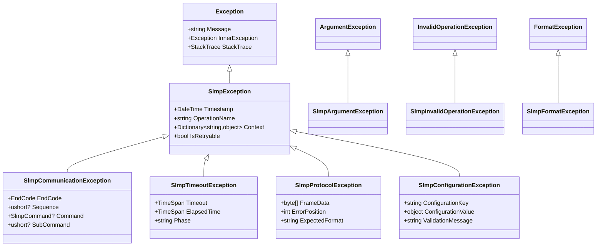

# エラーモデル仕様と例外マトリクス

## 例外体系図



## 例外クラス詳細仕様

### 1. SlmpException（基底クラス）
```csharp
/// <summary>
/// SLMP関連の全ての例外の基底クラス
/// </summary>
public abstract class SlmpException : Exception
{
    /// <summary>
    /// 例外発生時刻（UTC）
    /// </summary>
    public DateTime Timestamp { get; }
    
    /// <summary>
    /// 例外が発生した操作名
    /// </summary>
    public string? OperationName { get; set; }
    
    /// <summary>
    /// 例外発生時のコンテキスト情報
    /// </summary>
    public Dictionary<string, object> Context { get; }
    
    /// <summary>
    /// この例外がリトライ可能かどうか
    /// </summary>
    public abstract bool IsRetryable { get; }
    
    protected SlmpException(string message) : base(message)
    {
        Timestamp = DateTime.UtcNow;
        Context = new Dictionary<string, object>();
    }
    
    protected SlmpException(string message, Exception innerException) : base(message, innerException)
    {
        Timestamp = DateTime.UtcNow;
        Context = new Dictionary<string, object>();
    }
    
    /// <summary>
    /// コンテキスト情報を追加
    /// </summary>
    public SlmpException WithContext(string key, object value)
    {
        Context[key] = value;
        return this;
    }
    
    /// <summary>
    /// 操作名を設定
    /// </summary>
    public SlmpException WithOperation(string operationName)
    {
        OperationName = operationName;
        return this;
    }
}
```

### 2. SlmpCommunicationException（通信エラー）
```csharp
/// <summary>
/// SLMP通信エラー（PLCからのエラー応答を含む）
/// </summary>
public class SlmpCommunicationException : SlmpException
{
    /// <summary>
    /// SLMPエンドコード
    /// </summary>
    public EndCode EndCode { get; }
    
    /// <summary>
    /// エラーが発生したフレームのシーケンス番号
    /// </summary>
    public ushort? Sequence { get; set; }
    
    /// <summary>
    /// エラーが発生したSLMPコマンド
    /// </summary>
    public SlmpCommand? Command { get; set; }
    
    /// <summary>
    /// エラーが発生したサブコマンド
    /// </summary>
    public ushort? SubCommand { get; set; }
    
    /// <summary>
    /// PLCからの詳細エラー情報（存在する場合）
    /// </summary>
    public byte[]? DetailErrorInfo { get; set; }
    
    public override bool IsRetryable => DetermineRetryability(EndCode);
    
    public SlmpCommunicationException(EndCode endCode) 
        : base(GetErrorMessage(endCode))
    {
        EndCode = endCode;
        Context["EndCode"] = endCode.ToString();
        Context["EndCodeValue"] = $"0x{(int)endCode:X4}";
    }
    
    public SlmpCommunicationException(EndCode endCode, Exception innerException)
        : base(GetErrorMessage(endCode), innerException)
    {
        EndCode = endCode;
        Context["EndCode"] = endCode.ToString();
        Context["EndCodeValue"] = $"0x{(int)endCode:X4}";
    }
    
    private static string GetErrorMessage(EndCode endCode) => endCode switch
    {
        EndCode.Success => "Operation completed successfully",
        EndCode.WrongCommand => "Unsupported command",
        EndCode.WrongFormat => "Invalid frame format",
        EndCode.WrongLength => "Invalid data length", 
        EndCode.Busy => "PLC is busy, please retry later",
        EndCode.ExceedReqLength => "Request data length exceeds limit",
        EndCode.ExceedRespLength => "Response data length exceeds limit", 
        EndCode.ServerNotFound => "Server not found",
        EndCode.WrongConfigItem => "Invalid configuration item",
        EndCode.TimeoutError => "PLC communication timeout",
        _ => $"SLMP communication error: EndCode={endCode} (0x{(int)endCode:X4})"
    };
    
    private static bool DetermineRetryability(EndCode endCode) => endCode switch
    {
        EndCode.Busy => true,
        EndCode.TimeoutError => true,
        EndCode.RelayFailure => true,
        EndCode.OtherNetworkError => true,
        EndCode.ServerNotFound => true,
        EndCode.WrongCommand => false,
        EndCode.WrongFormat => false,
        EndCode.WrongLength => false,
        EndCode.WrongConfigItem => false,
        EndCode.ExceedReqLength => false,
        EndCode.ExceedRespLength => false,
        _ => false
    };
}
```

### 3. SlmpTimeoutException（タイムアウト）
```csharp
/// <summary>
/// SLMPタイムアウトエラー
/// </summary>
public class SlmpTimeoutException : SlmpException
{
    /// <summary>
    /// 設定されたタイムアウト時間
    /// </summary>
    public TimeSpan Timeout { get; }
    
    /// <summary>
    /// 実際の経過時間
    /// </summary> 
    public TimeSpan ElapsedTime { get; }
    
    /// <summary>
    /// タイムアウトが発生したフェーズ
    /// </summary>
    public string Phase { get; }
    
    /// <summary>
    /// タイムアウトの種類
    /// </summary>
    public TimeoutType TimeoutType { get; }
    
    public override bool IsRetryable => true;
    
    public SlmpTimeoutException(TimeSpan timeout, TimeSpan elapsedTime, string phase = "Communication")
        : base($"Operation timed out in {phase} phase after {elapsedTime.TotalMilliseconds:F0}ms (timeout: {timeout.TotalMilliseconds:F0}ms)")
    {
        Timeout = timeout;
        ElapsedTime = elapsedTime;
        Phase = phase;
        TimeoutType = DetermineTimeoutType(phase);
        
        Context["Timeout"] = timeout.TotalMilliseconds;
        Context["ElapsedTime"] = elapsedTime.TotalMilliseconds;
        Context["Phase"] = phase;
        Context["TimeoutType"] = TimeoutType.ToString();
    }
    
    private static TimeoutType DetermineTimeoutType(string phase) => phase switch
    {
        "Connection" => TimeoutType.Connection,
        "Send" => TimeoutType.Send,
        "Receive" => TimeoutType.Receive,
        "Communication" => TimeoutType.Communication,
        _ => TimeoutType.Unknown
    };
}

public enum TimeoutType
{
    Unknown,
    Connection,
    Send,
    Receive,
    Communication
}
```

### 4. SlmpProtocolException（プロトコルエラー）
```csharp
/// <summary>
/// SLMPプロトコル違反エラー
/// </summary>
public class SlmpProtocolException : SlmpException
{
    /// <summary>
    /// エラーが発生したフレームデータ
    /// </summary>
    public byte[] FrameData { get; }
    
    /// <summary>
    /// エラーが発生した位置（バイト単位）
    /// </summary>
    public int ErrorPosition { get; }
    
    /// <summary>
    /// 期待されたフォーマット
    /// </summary>
    public string ExpectedFormat { get; }
    
    /// <summary>
    /// 実際に受信したフォーマット
    /// </summary>
    public string ActualFormat { get; }
    
    public override bool IsRetryable => false;
    
    public SlmpProtocolException(string message, byte[] frameData, int errorPosition = -1, string expectedFormat = "", string actualFormat = "")
        : base(message)
    {
        FrameData = frameData ?? Array.Empty<byte>();
        ErrorPosition = errorPosition;
        ExpectedFormat = expectedFormat;
        ActualFormat = actualFormat;
        
        Context["FrameLength"] = FrameData.Length;
        Context["FrameData"] = Convert.ToHexString(FrameData.Take(Math.Min(64, FrameData.Length)).ToArray());
        Context["ErrorPosition"] = errorPosition;
        Context["ExpectedFormat"] = expectedFormat;
        Context["ActualFormat"] = actualFormat;
    }
}
```

### 5. SlmpConfigurationException（設定エラー）
```csharp
/// <summary>
/// SLMP設定エラー
/// </summary>
public class SlmpConfigurationException : SlmpException
{
    /// <summary>
    /// エラーが発生した設定キー
    /// </summary>
    public string ConfigurationKey { get; }
    
    /// <summary>
    /// 無効な設定値
    /// </summary>
    public object? ConfigurationValue { get; }
    
    /// <summary>
    /// 検証エラーメッセージ
    /// </summary>
    public string ValidationMessage { get; }
    
    public override bool IsRetryable => false;
    
    public SlmpConfigurationException(string configurationKey, object? configurationValue, string validationMessage)
        : base($"Invalid configuration '{configurationKey}': {validationMessage}")
    {
        ConfigurationKey = configurationKey;
        ConfigurationValue = configurationValue;
        ValidationMessage = validationMessage;
        
        Context["ConfigurationKey"] = configurationKey;
        Context["ConfigurationValue"] = configurationValue?.ToString() ?? "<null>";
        Context["ValidationMessage"] = validationMessage;
    }
}
```

## 例外発生条件マトリクス

### SlmpCommunicationException発生条件

| EndCode | 発生条件 | メッセージ | リトライ可能 | 対処法 |
|---------|----------|------------|-------------|-------|
| **Success** | 正常完了 | Operation completed successfully | - | - |
| **WrongCommand** | 未対応コマンド | Unsupported command | ❌ | コマンドコードを確認 |
| **WrongFormat** | フレーム形式エラー | Invalid frame format | ❌ | Binary/ASCII、3E/4E設定確認 |
| **WrongLength** | データ長エラー | Invalid data length | ❌ | 要求データサイズを確認 |
| **Busy** | PLC処理中 | PLC is busy, please retry later | ✅ | 少し待ってリトライ |
| **ExceedReqLength** | 要求長超過 | Request data length exceeds limit | ❌ | 一度に読む点数を減らす |
| **ExceedRespLength** | 応答長超過 | Response data length exceeds limit | ❌ | 一度に読む点数を減らす |
| **ServerNotFound** | サーバー未発見 | Server not found | ✅ | ネットワーク設定確認 |
| **WrongConfigItem** | 設定項目エラー | Invalid configuration item | ❌ | Target設定を確認 |
| **PrmIDNotFound** | パラメータID未発見 | Parameter ID not found | ❌ | 指定パラメータを確認 |
| **TimeoutError** | PLC側タイムアウト | PLC communication timeout | ✅ | タイムアウト値を増やす |
| **RelayFailure** | 中継局エラー | Relay station failure | ✅ | ネットワーク状態確認 |

### SlmpTimeoutException発生条件

| Phase | 発生条件 | Timeout値 | 対処法 |
|-------|----------|-----------|-------|
| **Connection** | ソケット接続時 | ConnectTimeout | ネットワーク疎通確認、タイムアウト値増加 |
| **Send** | データ送信時 | SendTimeout | ネットワーク負荷確認 |
| **Receive** | データ受信時 | ReceiveTimeout | PLC負荷確認、タイムアウト値増加 |
| **Communication** | SLMP通信全体 | CommandTimeout | PLC処理時間確認、タイムアウト値増加 |

### SlmpProtocolException発生条件

| 条件 | ErrorPosition | ExpectedFormat | ActualFormat | 対処法 |
|------|---------------|----------------|--------------|-------|
| 不正なフレームヘッダー | 0-1 | "D0xx" or "54xx" | 受信データ | Binary/ASCII設定確認 |
| 不正なデータ長 | 9-10 (Binary) | リトルエンディアン16bit | 受信データ | フレーム構築ロジック確認 |
| 不正なエンドコード | データ部 | "0000" (正常) | 受信エンドコード | PLC側エラー原因調査 |
| フレーム切り捨て | -1 | "完全なフレーム" | "不完全なフレーム" | 受信バッファサイズ確認 |

### 引数検証例外

| Exception | 発生条件 | パラメータ | 対処法 |
|-----------|----------|------------|-------|
| **ArgumentNullException** | null引数 | deviceCode, data, address等 | null以外の値を指定 |
| **ArgumentOutOfRangeException** | 範囲外値 | startAddress > 0xFFFFFF | 有効範囲内の値を指定 |
| **ArgumentException** | 無効な引数 | count = 0, 空配列等 | 有効な値を指定 |

## エラーハンドリングパターン

### 1. リトライ可能エラーの処理
```csharp
public async Task<T> ExecuteWithRetryAsync<T>(Func<Task<T>> operation, int maxRetries = 3)
{
    var retryPolicy = new SlmpRetryPolicy(maxRetries);
    
    return await retryPolicy.ExecuteAsync(async () =>
    {
        try
        {
            return await operation();
        }
        catch (SlmpCommunicationException ex) when (ex.IsRetryable)
        {
            // リトライ可能な通信エラー
            _logger.LogWarning(ex, "Retryable communication error: {EndCode}", ex.EndCode);
            throw;
        }
        catch (SlmpTimeoutException ex)
        {
            // タイムアウトエラー（リトライ可能）
            _logger.LogWarning(ex, "Timeout error in {Phase}: {ElapsedTime}ms", ex.Phase, ex.ElapsedTime.TotalMilliseconds);
            throw;
        }
        catch (SlmpCommunicationException ex) when (!ex.IsRetryable)
        {
            // リトライ不可能な通信エラー
            _logger.LogError(ex, "Non-retryable communication error: {EndCode}", ex.EndCode);
            throw;
        }
    });
}
```

### 2. エラー種別による分岐処理
```csharp
public async Task<ProcessResult> ProcessDeviceOperationAsync()
{
    try
    {
        var result = await _client.ReadWordDevicesAsync(DeviceCode.D, 0, 100);
        return ProcessResult.Success(result);
    }
    catch (SlmpCommunicationException ex) when (ex.EndCode == EndCode.Busy)
    {
        // PLC処理中 - 後で再試行
        _logger.LogInformation("PLC is busy, scheduling retry");
        return ProcessResult.Retry();
    }
    catch (SlmpCommunicationException ex) when (ex.EndCode == EndCode.ExceedReqLength)
    {
        // 要求サイズ過大 - サイズを減らして再試行
        _logger.LogWarning("Request size too large, reducing count");
        var result = await _client.ReadWordDevicesAsync(DeviceCode.D, 0, 50);
        return ProcessResult.PartialSuccess(result);
    }
    catch (SlmpTimeoutException ex) when (ex.TimeoutType == TimeoutType.Connection)
    {
        // 接続タイムアウト - ネットワーク問題
        _logger.LogError(ex, "Connection timeout, network issue suspected");
        return ProcessResult.NetworkError();
    }
    catch (SlmpProtocolException ex)
    {
        // プロトコルエラー - 設定問題
        _logger.LogError(ex, "Protocol error at position {ErrorPosition}", ex.ErrorPosition);
        return ProcessResult.ConfigurationError();
    }
    catch (SlmpException ex)
    {
        // その他のSLMPエラー
        _logger.LogError(ex, "SLMP error in operation {Operation}", ex.OperationName);
        return ProcessResult.Error(ex.Message);
    }
}
```

### 3. グローバル例外ハンドラー
```csharp
public class SlmpGlobalExceptionHandler
{
    private readonly ILogger<SlmpGlobalExceptionHandler> _logger;
    
    public async Task<ErrorResponse> HandleExceptionAsync(Exception exception, string correlationId)
    {
        return exception switch
        {
            SlmpCommunicationException commEx => await HandleCommunicationExceptionAsync(commEx, correlationId),
            SlmpTimeoutException timeoutEx => await HandleTimeoutExceptionAsync(timeoutEx, correlationId),
            SlmpProtocolException protocolEx => await HandleProtocolExceptionAsync(protocolEx, correlationId),
            SlmpConfigurationException configEx => await HandleConfigurationExceptionAsync(configEx, correlationId),
            ArgumentException argEx => HandleArgumentException(argEx, correlationId),
            InvalidOperationException opEx => HandleInvalidOperationException(opEx, correlationId),
            _ => HandleUnknownException(exception, correlationId)
        };
    }
    
    private async Task<ErrorResponse> HandleCommunicationExceptionAsync(SlmpCommunicationException ex, string correlationId)
    {
        var severity = ex.IsRetryable ? LogLevel.Warning : LogLevel.Error;
        
        _logger.Log(severity, ex,
            "SLMP communication error: EndCode={EndCode}, Command={Command}, Sequence={Sequence}, CorrelationId={CorrelationId}",
            ex.EndCode, ex.Command, ex.Sequence, correlationId);
        
        return new ErrorResponse
        {
            ErrorCode = $"SLMP_{ex.EndCode}",
            Message = ex.Message,
            IsRetryable = ex.IsRetryable,
            CorrelationId = correlationId,
            Details = ex.Context
        };
    }
}
```

### 4. カスタム例外ファクトリー
```csharp
public static class SlmpExceptionFactory
{
    public static SlmpCommunicationException CreateCommunicationException(
        EndCode endCode,
        SlmpCommand? command = null,
        ushort? sequence = null,
        ushort? subCommand = null)
    {
        var ex = new SlmpCommunicationException(endCode);
        
        if (command.HasValue)
            ex.Command = command.Value;
        if (sequence.HasValue)
            ex.Sequence = sequence.Value;
        if (subCommand.HasValue)
            ex.SubCommand = subCommand.Value;
            
        return ex;
    }
    
    public static SlmpTimeoutException CreateTimeoutException(
        TimeSpan timeout,
        TimeSpan elapsedTime,
        string phase = "Communication")
    {
        return new SlmpTimeoutException(timeout, elapsedTime, phase);
    }
    
    public static SlmpProtocolException CreateProtocolException(
        string message,
        byte[] frameData,
        int errorPosition = -1,
        string expectedFormat = "",
        string actualFormat = "")
    {
        return new SlmpProtocolException(message, frameData, errorPosition, expectedFormat, actualFormat);
    }
}
```

## 例外ログ出力例

### 構造化ログ出力例
```json
{
  "timestamp": "2024-12-23T10:15:30.123Z",
  "level": "Error",
  "message": "SLMP communication error: EndCode=WrongCommand, Command=Device_Read, Sequence=123",
  "exception": {
    "type": "SlmpCommunicationException",
    "message": "Unsupported command",
    "endCode": "WrongCommand", 
    "endCodeValue": "0xC059",
    "command": "Device_Read",
    "sequence": 123,
    "isRetryable": false
  },
  "context": {
    "operation": "ReadWordDevices",
    "deviceCode": "D",
    "startAddress": 0,
    "count": 100,
    "correlationId": "550e8400-e29b-41d4-a716-446655440000"
  },
  "source": "SlmpClient.Core.SlmpClient"
}
```

この例外マトリクスにより、SlmpClientの全てのエラー状況に対して一貫性のある適切な例外処理を実装できます。