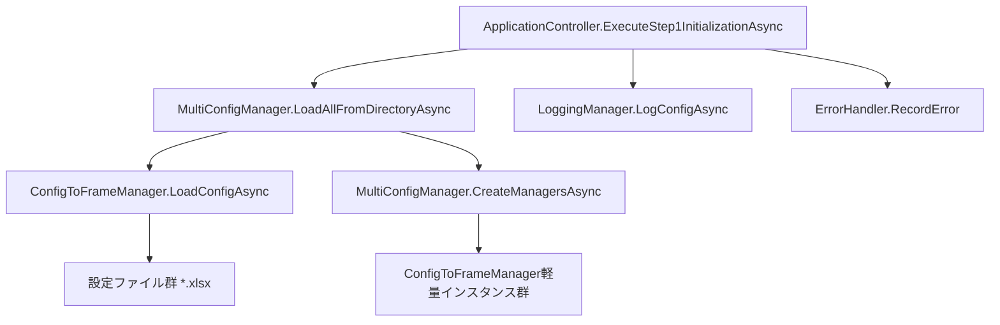
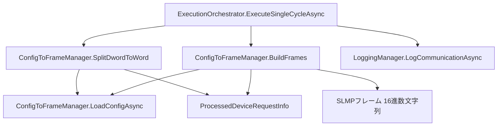
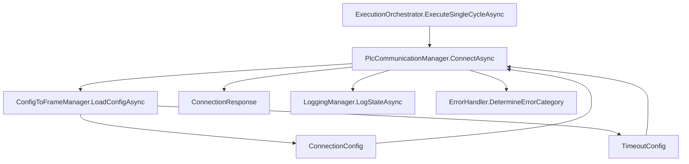
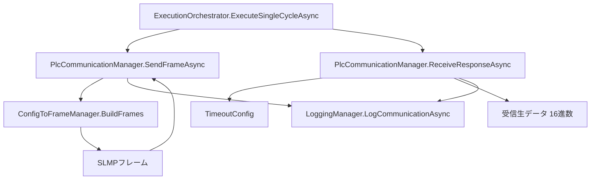
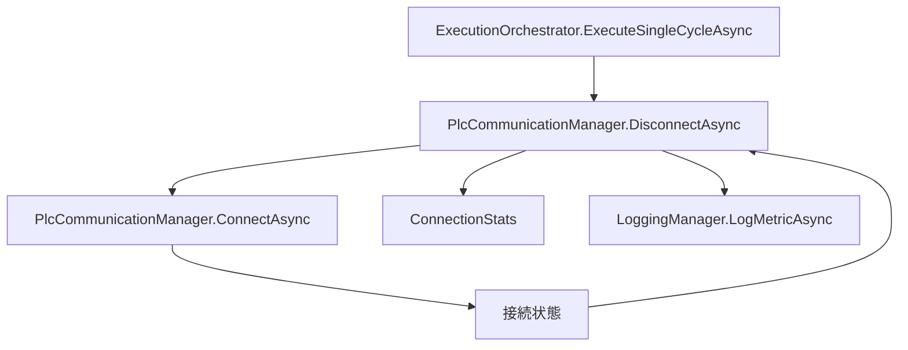
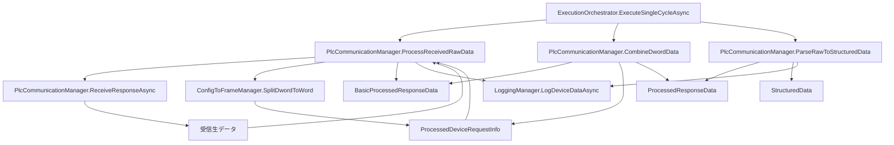
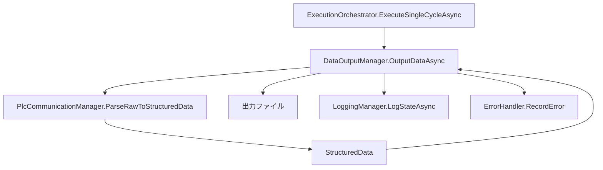

# クラス・メソッド依存関係図

## 目次
1. [概要](#概要)
2. [ステップ別依存関係](#ステップ別依存関係)
3. [クラス間依存関係マトリクス](#クラス間依存関係マトリクス)
4. [詳細メソッド依存関係](#詳細メソッド依存関係)
5. [インターフェース依存関係](#インターフェース依存関係)

---

## 概要

本文書は、アプリケーション内の全クラス・メソッド間の依存関係を整理したものです。

### 主要レイヤー構造
```
┌─────────────────────────────────────────────────────────┐
│ エントリーポイント層 (Program.cs)                      │
├─────────────────────────────────────────────────────────┤
│ ホストサービス層 (AndonHostedService)                   │
├─────────────────────────────────────────────────────────┤
│ アプリケーション制御層 (ApplicationController)          │
├─────────────────────────────────────────────────────────┤
│ 実行制御層 (ExecutionOrchestrator)                      │
├─────────────────────────────────────────────────────────┤
│ ビジネスロジック層                                      │
│ - ConfigToFrameManager                                  │
│ - PlcCommunicationManager                              │
│ - DataOutputManager                                    │
├─────────────────────────────────────────────────────────┤
│ インフラストラクチャ層                                  │
│ - LoggingManager                                       │
│ - ErrorHandler                                         │
│ - ResourceManager                                      │
│ - 非同期処理支援クラス群                                │
├─────────────────────────────────────────────────────────┤
│ データモデル層 (ConfigModels, DTOs)                     │
└─────────────────────────────────────────────────────────┘
```

---

## ステップ別依存関係

### Step1: 設定ファイル読み込み



**依存関係詳細:**
- `ApplicationController.ExecuteStep1InitializationAsync()`
  - → `MultiConfigManager.LoadAllFromDirectoryAsync()` (複数設定ファイル読み込み)
  - → `MultiConfigManager.CreateManagersAsync()` (軽量インスタンス作成)
  - → `LoggingManager.LogConfigAsync()` (設定情報ログ出力)
  - → `ErrorHandler.RecordError()` (エラー記録)

- `MultiConfigManager.LoadAllFromDirectoryAsync()`
  - → `ConfigToFrameManager.LoadConfigAsync()` (各設定ファイル読み込み)
  - → 外部設定ファイル群 (`*_settings.xlsx`)

- `ConfigToFrameManager.LoadConfigAsync()`
  - → 外部設定ファイル (`appsettings.xlsx` または `*_settings.xlsx`)
  - ← **Output:** ConnectionConfig, TimeoutConfig, TargetDeviceConfig, SystemResourcesConfig, DataProcessingConfig, LoggingConfig, DataTransferConfig

---

### Step2: フレーム構築



**依存関係詳細:**
- `ExecutionOrchestrator.ExecuteSingleCycleAsync()`
  - → `ConfigToFrameManager.SplitDwordToWord()` (デバイスデータ前処理)
  - → `ConfigToFrameManager.BuildFrames()` (通信フレーム構築)

- `ConfigToFrameManager.SplitDwordToWord()`
  - ← **Input:** TargetDeviceConfig (from `LoadConfigAsync()`)
  - → **Output:** ProcessedDeviceRequestInfo

- `ConfigToFrameManager.BuildFrames()`
  - ← **Input:** ConnectionConfig (from `LoadConfigAsync()`), ProcessedDeviceRequestInfo (from `SplitDwordToWord()`)
  - → **Output:** SLMPフレーム (16進数文字列)

---

### Step3: PLC接続



**依存関係詳細:**
- `ExecutionOrchestrator.ExecuteSingleCycleAsync()`
  - → `PlcCommunicationManager.ConnectAsync()` (PLC接続処理)

- `PlcCommunicationManager.ConnectAsync()`
  - ← **Input:** ConnectionConfig (from `ConfigToFrameManager.LoadConfigAsync()`), TimeoutConfig (from `ConfigToFrameManager.LoadConfigAsync()`)
  - → **Output:** ConnectionResponse (接続結果)
  - → `LoggingManager.LogStateAsync()` (接続状態ログ)
  - → `ErrorHandler.DetermineErrorCategory()` (エラー時)

---

### Step4: データ送受信



**依存関係詳細:**
- `ExecutionOrchestrator.ExecuteSingleCycleAsync()`
  - → `PlcCommunicationManager.SendFrameAsync()` (フレーム送信)
  - → `PlcCommunicationManager.ReceiveResponseAsync()` (レスポンス受信)

- `PlcCommunicationManager.SendFrameAsync()`
  - ← **Input:** SLMPフレーム (from `ConfigToFrameManager.BuildFrames()`)
  - → `LoggingManager.LogCommunicationAsync()` (送信データログ)

- `PlcCommunicationManager.ReceiveResponseAsync()`
  - ← **Input:** TimeoutConfig (Step3で既にSocket設定済み)
  - → **Output:** 受信生データ (16進数文字列)
  - → `LoggingManager.LogCommunicationAsync()` (受信データログ)

---

### Step5: PLC切断



**依存関係詳細:**
- `ExecutionOrchestrator.ExecuteSingleCycleAsync()`
  - → `PlcCommunicationManager.DisconnectAsync()` (PLC切断処理)

- `PlcCommunicationManager.DisconnectAsync()`
  - ← **Input:** 接続状態 (from `ConnectAsync()`)
  - → **Output:** ConnectionStats (通信統計情報)
  - → `LoggingManager.LogMetricAsync()` (統計ログ)

---

### Step6: データ解析



**依存関係詳細:**
- `ExecutionOrchestrator.ExecuteSingleCycleAsync()`
  - → `PlcCommunicationManager.ProcessReceivedRawData()` (基本後処理)
  - → `PlcCommunicationManager.CombineDwordData()` (DWord結合処理)
  - → `PlcCommunicationManager.ParseRawToStructuredData()` (構造化変換)

- `PlcCommunicationManager.ProcessReceivedRawData()`
  - ← **Input:** 受信生データ (from `ReceiveResponseAsync()`), ProcessedDeviceRequestInfo (from `ConfigToFrameManager.SplitDwordToWord()`)
  - → **Output:** BasicProcessedResponseData (基本後処理結果)
  - → `LoggingManager.LogDeviceDataAsync()` (デバイスデータログ)

- `PlcCommunicationManager.CombineDwordData()`
  - ← **Input:** BasicProcessedResponseData (from `ProcessReceivedRawData()`), ProcessedDeviceRequestInfo (from `ConfigToFrameManager.SplitDwordToWord()`)
  - → **Output:** ProcessedResponseData (DWord結合済み)

- `PlcCommunicationManager.ParseRawToStructuredData()`
  - ← **Input:** ProcessedResponseData (from `CombineDwordData()`)
  - → **Output:** StructuredData (SLMP構造化解析結果)
  - → `LoggingManager.LogDeviceDataAsync()` (解釈情報ログ)

---

### Step7: データ出力



**依存関係詳細:**
- `ExecutionOrchestrator.ExecuteSingleCycleAsync()`
  - → `DataOutputManager.OutputDataAsync()` (データ出力)

- `DataOutputManager.OutputDataAsync()`
  - ← **Input:** StructuredData (from `PlcCommunicationManager.ParseRawToStructuredData()`), 出力設定 (FilePath, Format)
  - → **Output:** 出力ファイル (指定場所・形式)
  - → `LoggingManager.LogStateAsync()` (出力完了ログ)
  - → `ErrorHandler.RecordError()` (エラー時)

---

## クラス間依存関係マトリクス

| クラス ↓ / 依存先 → | ConfigToFrame<br>Manager | PlcCommunication<br>Manager | DataOutput<br>Manager | Logging<br>Manager | Error<br>Handler | Resource<br>Manager | Application<br>Controller | Execution<br>Orchestrator | Multi<br>ConfigManager |
|:---|:---:|:---:|:---:|:---:|:---:|:---:|:---:|:---:|:---:|
| **Program** | - | - | - | ✓ | ✓ | - | ✓ | - | - |
| **AndonHostedService** | - | - | - | ✓ | - | - | ✓ | - | - |
| **ApplicationController** | ✓ | - | - | ✓ | ✓ | ✓ | - | ✓ | ✓ |
| **ExecutionOrchestrator** | ✓ | ✓ | ✓ | ✓ | ✓ | - | - | - | - |
| **ConfigToFrameManager** | - | - | - | ✓ | ✓ | - | - | - | - |
| **PlcCommunicationManager** | ✓ | - | - | ✓ | ✓ | - | - | - | - |
| **DataOutputManager** | - | - | - | ✓ | ✓ | - | - | - | - |
| **LoggingManager** | - | - | - | - | ✓ | ✓ | - | - | - |
| **ErrorHandler** | - | - | - | ✓ | - | - | - | - | - |
| **ResourceManager** | - | - | - | ✓ | ✓ | - | - | - | - |
| **MultiConfigManager** | ✓ | - | - | ✓ | ✓ | - | - | - | - |
| **GracefulShutdownHandler** | - | - | - | ✓ | - | - | ✓ | - | - |
| **AsyncExceptionHandler** | - | - | - | ✓ | ✓ | - | - | - | - |
| **CancellationCoordinator** | - | - | - | ✓ | - | - | - | - | - |
| **ResourceSemaphoreManager** | - | - | - | ✓ | - | - | - | - | - |
| **ParallelExecutionController** | - | - | - | ✓ | ✓ | - | - | ✓ | - |
| **TimerService** | - | - | - | ✓ | - | - | - | - | - |

**凡例:**
- ✓ : 依存あり (メソッド呼び出し、データ取得)
- \- : 依存なし

---

## 詳細メソッド依存関係

### ConfigToFrameManagerクラス

#### LoadConfigAsync
- **Input:**
  - configFileName (string)
  - 外部設定ファイル (appsettings.xlsx)
- **Output:**
  - ConnectionConfig
  - TimeoutConfig
  - TargetDeviceConfig
  - MonitoringIntervalMs
  - SystemResourcesConfig
  - DataProcessingConfig
  - LoggingConfig
  - DataTransferConfig
  - ActualConfigPath
- **依存先:**
  - なし (外部ファイル読み込みのみ)
- **依存元:**
  - `MultiConfigManager.LoadAllFromDirectoryAsync()`
  - `ApplicationController.ExecuteStep1InitializationAsync()`

#### SplitDwordToWord
- **Input:**
  - TargetDeviceConfig ← `LoadConfigAsync()`
- **Output:**
  - ProcessedDeviceRequestInfo
- **依存先:**
  - `LoadConfigAsync()` → TargetDeviceConfig
- **依存元:**
  - `ExecutionOrchestrator.ExecuteSingleCycleAsync()`
  - `PlcCommunicationManager.ProcessReceivedRawData()`
  - `PlcCommunicationManager.CombineDwordData()`

#### BuildFrames
- **Input:**
  - ConnectionConfig ← `LoadConfigAsync()`
  - ProcessedDeviceRequestInfo ← `SplitDwordToWord()`
- **Output:**
  - SLMPフレーム (16進数文字列)
- **依存先:**
  - `LoadConfigAsync()` → ConnectionConfig
  - `SplitDwordToWord()` → ProcessedDeviceRequestInfo
- **依存元:**
  - `ExecutionOrchestrator.ExecuteSingleCycleAsync()`
  - `PlcCommunicationManager.SendFrameAsync()`

---

### MultiConfigManagerクラス

#### LoadAllFromDirectoryAsync
- **Input:**
  - configDirectory (string)
  - filePattern (string)
  - allowPartialSuccess (bool)
- **Output:**
  - Dictionary<string, ConfigToFrameManager> (軽量インスタンス辞書)
  - LoadResult (LoadedFiles, FailedFiles, TotalLoadTime)
- **依存先:**
  - `ConfigToFrameManager.LoadConfigAsync()` (各設定ファイル)
  - 外部設定ファイル群 (*_settings.xlsx)
- **依存元:**
  - `ApplicationController.ExecuteStep1InitializationAsync()`

#### CreateManagersAsync
- **Input:**
  - configFileNames (string[])
- **Output:**
  - ConfigToFrameManager[] (軽量インスタンス配列)
- **依存先:**
  - SharedConfigData (静的共有領域)
- **依存元:**
  - `ApplicationController.ExecuteStep1InitializationAsync()`

#### GetSharedConfigData
- **Input:**
  - configFileName (string)
- **Output:**
  - ConfigDataSet
- **依存先:**
  - SharedConfigData (静的共有領域)
- **依存元:**
  - `ConfigToFrameManager.GetConfig()`

#### ReleaseSharedData
- **Input:**
  - configFileName (string, オプション)
- **Output:**
  - ReleasedMemoryKB
- **依存先:**
  - SharedConfigData (静的共有領域)
- **依存元:**
  - `ResourceManager.OptimizeMemory()`

---

### PlcCommunicationManagerクラス

#### ConnectAsync
- **Input:**
  - ConnectionConfig ← `ConfigToFrameManager.LoadConfigAsync()`
  - TimeoutConfig ← `ConfigToFrameManager.LoadConfigAsync()`
- **Output:**
  - ConnectionResponse (成功時: Socket, RemoteEndPoint, ConnectedAt, ConnectionTime)
  - 失敗時: 例外スロー (TimeoutException, SocketException, etc.)
- **依存先:**
  - `ConfigToFrameManager.LoadConfigAsync()` → ConnectionConfig, TimeoutConfig
  - `LoggingManager.LogStateAsync()` (接続状態ログ)
  - `ErrorHandler.DetermineErrorCategory()` (エラー時)
- **依存元:**
  - `ExecutionOrchestrator.ExecuteSingleCycleAsync()`

#### SendFrameAsync
- **Input:**
  - SLMPフレーム ← `ConfigToFrameManager.BuildFrames()`
  - Socket.SendTimeout (Step3で既設定済み)
- **Output:**
  - 送信完了状態
- **依存先:**
  - `ConfigToFrameManager.BuildFrames()` → SLMPフレーム
  - `LoggingManager.LogCommunicationAsync()` (送信データログ)
- **依存元:**
  - `ExecutionOrchestrator.ExecuteSingleCycleAsync()`

#### ReceiveResponseAsync
- **Input:**
  - Socket.ReceiveTimeout (Step3で既設定済み)
- **Output:**
  - 受信生データ (16進数文字列)
- **依存先:**
  - `LoggingManager.LogCommunicationAsync()` (受信データログ)
- **依存元:**
  - `ExecutionOrchestrator.ExecuteSingleCycleAsync()`
  - `PlcCommunicationManager.ProcessReceivedRawData()`

#### DisconnectAsync
- **Input:**
  - 接続状態 ← `ConnectAsync()`
  - 通信統計情報 (内部保持)
- **Output:**
  - ConnectionStats
- **依存先:**
  - `LoggingManager.LogMetricAsync()` (統計ログ)
- **依存元:**
  - `ExecutionOrchestrator.ExecuteSingleCycleAsync()`

#### Disconnect (同期版)
- **Input:**
  - 内部状態 (_socket, _isConnected, _disposed)
- **Output:**
  - void (ソケット切断、リソース解放)
- **依存先:**
  - なし (内部処理のみ)
- **依存元:**
  - `Dispose()`

#### Dispose
- **Input:**
  - なし (IDisposableインターフェース)
- **Output:**
  - void (リソース解放)
- **依存先:**
  - `Disconnect()` (実際のリソース解放)
- **依存元:**
  - using文終了時、明示的Dispose呼び出し

#### ProcessReceivedRawData
- **Input:**
  - 受信生データ ← `ReceiveResponseAsync()`
  - ProcessedDeviceRequestInfo ← `ConfigToFrameManager.SplitDwordToWord()`
- **Output:**
  - BasicProcessedResponseData
- **依存先:**
  - `ReceiveResponseAsync()` → 受信生データ
  - `ConfigToFrameManager.SplitDwordToWord()` → ProcessedDeviceRequestInfo
  - `LoggingManager.LogDeviceDataAsync()` (デバイスデータログ)
- **依存元:**
  - `ExecutionOrchestrator.ExecuteSingleCycleAsync()`
  - `PlcCommunicationManager.CombineDwordData()`

#### CombineDwordData
- **Input:**
  - BasicProcessedResponseData ← `ProcessReceivedRawData()`
  - ProcessedDeviceRequestInfo ← `ConfigToFrameManager.SplitDwordToWord()`
- **Output:**
  - ProcessedResponseData
- **依存先:**
  - `ProcessReceivedRawData()` → BasicProcessedResponseData
  - `ConfigToFrameManager.SplitDwordToWord()` → ProcessedDeviceRequestInfo
- **依存元:**
  - `ExecutionOrchestrator.ExecuteSingleCycleAsync()`
  - `PlcCommunicationManager.ParseRawToStructuredData()`

#### ParseRawToStructuredData
- **Input:**
  - ProcessedResponseData ← `CombineDwordData()`
- **Output:**
  - StructuredData
- **依存先:**
  - `CombineDwordData()` → ProcessedResponseData
  - `LoggingManager.LogDeviceDataAsync()` (解釈情報ログ)
- **依存元:**
  - `ExecutionOrchestrator.ExecuteSingleCycleAsync()`
  - `DataOutputManager.OutputDataAsync()`

---

### DataOutputManagerクラス

#### OutputDataAsync
- **Input:**
  - StructuredData ← `PlcCommunicationManager.ParseRawToStructuredData()`
  - 出力設定 (FilePath, Format)
- **Output:**
  - 出力ファイル (指定場所・形式)
- **依存先:**
  - `PlcCommunicationManager.ParseRawToStructuredData()` → StructuredData
  - `LoggingManager.LogStateAsync()` (出力完了ログ)
  - `ErrorHandler.RecordError()` (エラー時)
- **依存元:**
  - `ExecutionOrchestrator.ExecuteSingleCycleAsync()`

---

### LoggingManagerクラス

#### InitializeAsync
- **Input:**
  - LoggingConfig ← `ConfigToFrameManager.LoadConfigAsync()`
- **Output:**
  - 初期化状態
- **依存先:**
  - `ConfigToFrameManager.LoadConfigAsync()` → LoggingConfig
- **依存元:**
  - `ApplicationController.StartAsync()`

#### SetCorrelationId
- **Input:**
  - SessionId (処理セッション識別子)
- **Output:**
  - 関連付け設定完了状態
- **依存先:**
  - なし
- **依存元:**
  - `ApplicationController.StartAsync()`

#### SetLogLevel
- **Input:**
  - LogLevel (出力レベル指定)
- **Output:**
  - レベル設定完了状態
- **依存先:**
  - なし
- **依存元:**
  - `ApplicationController.StartAsync()`
  - `Program.ConfigureLogging()`

#### LogConfigAsync
- **Input:**
  - 全設定オブジェクト ← `ConfigToFrameManager.LoadConfigAsync()`
- **Output:**
  - 設定情報ログ出力完了
- **依存先:**
  - `ConfigToFrameManager.LoadConfigAsync()` → 各種設定
- **依存元:**
  - `ApplicationController.ExecuteStep1InitializationAsync()`

#### LogCommunicationAsync
- **Input:**
  - SLMPフレーム ← `ConfigToFrameManager.BuildFrames()`, `PlcCommunicationManager.ReceiveResponseAsync()`
  - フレーム解析結果
  - 通信統計
- **Output:**
  - 通信ログ出力完了
- **依存先:**
  - `ConfigToFrameManager.BuildFrames()` → 送信フレーム
  - `PlcCommunicationManager.ReceiveResponseAsync()` → 受信フレーム
- **依存元:**
  - `PlcCommunicationManager.SendFrameAsync()`
  - `PlcCommunicationManager.ReceiveResponseAsync()`

#### LogStateAsync
- **Input:**
  - セッション情報、サイクル情報、処理状況
- **Output:**
  - 状態ログ出力完了
- **依存先:**
  - なし (状態情報を受け取るのみ)
- **依存元:**
  - `PlcCommunicationManager.ConnectAsync()`
  - `DataOutputManager.OutputDataAsync()`
  - `ExecutionOrchestrator.ExecuteSingleCycleAsync()`

#### LogMetricAsync
- **Input:**
  - 実行統計、応答時間分析、システム稼働状況
- **Output:**
  - 統計ログ出力完了
- **依存先:**
  - `PlcCommunicationManager.DisconnectAsync()` → 応答時間統計
  - `ResourceManager.GetMemoryUsage()` → リソース使用状況
- **依存元:**
  - `PlcCommunicationManager.DisconnectAsync()`
  - `ExecutionOrchestrator.ExecuteSingleCycleAsync()`

#### LogErrorAsync
- **Input:**
  - エラー分類、エラー詳細、回復処理結果
- **Output:**
  - エラーログ出力完了
- **依存先:**
  - `ErrorHandler.DetermineErrorCategory()` → エラー分類
- **依存元:**
  - `ErrorHandler.RecordError()`
  - 各クラスのエラー発生時

#### LogDeviceDataAsync
- **Input:**
  - 生データ、解釈結果、ステータス判定
- **Output:**
  - デバイスデータログ出力完了
- **依存先:**
  - `PlcCommunicationManager.ProcessReceivedRawData()` → 基本データ
  - `PlcCommunicationManager.ParseRawToStructuredData()` → 解釈情報
- **依存元:**
  - `PlcCommunicationManager.ProcessReceivedRawData()`
  - `PlcCommunicationManager.ParseRawToStructuredData()`

#### FlushAsync
- **Input:**
  - FlushTarget (ファイル指定)
- **Output:**
  - フラッシュ完了状態
- **依存先:**
  - なし
- **依存元:**
  - `ApplicationController.StopAsync()`
  - `GracefulShutdownHandler.ExecuteGracefulShutdown()`

---

### ErrorHandlerクラス

#### DetermineErrorCategory
- **Input:**
  - Exception (発生したエラー)
  - StepNumber (Step1-7のステップ番号)
- **Output:**
  - ErrorCategory
  - Severity
- **依存先:**
  - なし (例外オブジェクトを分析するのみ)
- **依存元:**
  - `PlcCommunicationManager.ConnectAsync()` (エラー時)
  - `DataOutputManager.OutputDataAsync()` (エラー時)
  - `ErrorHandler.RecordError()`

#### RecordError
- **Input:**
  - ErrorCategory ← `DetermineErrorCategory()`
  - Severity ← `DetermineErrorCategory()`
  - ErrorMessage
  - Exception
  - StepNumber
- **Output:**
  - 記録完了状態
- **依存先:**
  - `DetermineErrorCategory()` → エラー分類・重要度
  - `LoggingManager.LogErrorAsync()` → ログ出力
- **依存元:**
  - 各クラスのエラー発生時

#### ApplyErrorPolicy
- **Input:**
  - ErrorCategory ← `DetermineErrorCategory()`
  - StepNumber
- **Output:**
  - ErrorAction (継続/終了判定)
- **依存先:**
  - `DetermineErrorCategory()` → エラー分類
  - `ConfigToFrameManager.LoadConfigAsync()` → エラー継続設定
- **依存元:**
  - `ExecutionOrchestrator.RunContinuousDataCycleAsync()` (エラー発生時)

#### ApplyRetryPolicy
- **Input:**
  - ErrorCategory ← `DetermineErrorCategory()`
  - StepNumber
  - CurrentRetryCount
- **Output:**
  - ShouldRetry
  - MaxRetryCount
- **依存先:**
  - `DetermineErrorCategory()` → エラー分類
  - `ConfigToFrameManager.LoadConfigAsync()` → リトライ設定
- **依存元:**
  - `ExecutionOrchestrator.RunContinuousDataCycleAsync()` (リトライ判定時)

---

### ResourceManagerクラス

#### GetMemoryUsage
- **Input:**
  - システム状態 (現在のメモリ使用状況)
- **Output:**
  - 現在のメモリ使用量 (KB単位)
  - 各コンポーネント別使用量
- **依存先:**
  - システムAPI (GC.GetTotalMemory(), Process.WorkingSet64等)
  - 各クラスの内部状態
- **依存元:**
  - `ResourceManager.EvaluateLevel()`
  - `LoggingManager.LogMetricAsync()`

#### EvaluateLevel
- **Input:**
  - 現在メモリ使用量 ← `GetMemoryUsage()`
  - 閾値設定 ← `ConfigToFrameManager.LoadConfigAsync()`
- **Output:**
  - メモリレベル (Normal, Warning, Critical)
  - 推奨アクション
- **依存先:**
  - `GetMemoryUsage()` → 現在使用量
  - `ConfigToFrameManager.LoadConfigAsync()` → 閾値設定
- **依存元:**
  - `ResourceManager.ApplyDataAndLoggingPolicy()`
  - `ResourceManager.RunMonitoringLoopAsync()`

#### ApplyDataAndLoggingPolicy
- **Input:**
  - メモリレベル ← `EvaluateLevel()`
  - ポリシー設定 ← `ConfigToFrameManager.LoadConfigAsync()`
- **Output:**
  - 適用されたポリシー内容
  - データ処理制限設定
- **依存先:**
  - `EvaluateLevel()` → レベル判定結果
  - `ConfigToFrameManager.LoadConfigAsync()` → システムリソース設定
- **依存元:**
  - `ResourceManager.OptimizeMemory()`

#### OptimizeMemory
- **Input:**
  - 最適化対象 (各クラスインスタンス)
  - 最適化レベル ← `EvaluateLevel()`
- **Output:**
  - 最適化実行結果
  - 削減されたメモリ量
- **依存先:**
  - `PlcCommunicationManager`, `ConfigToFrameManager`, `LoggingManager` (メモリ解放対象)
  - `ApplyDataAndLoggingPolicy()` → 最適化方針
- **依存元:**
  - `ResourceManager.RunMonitoringLoopAsync()`

#### WriteLogAsync
- **Input:**
  - メモリ使用状況 ← `GetMemoryUsage()`
  - メモリレベル ← `EvaluateLevel()`
  - 最適化結果 ← `OptimizeMemory()`
- **Output:**
  - ログ出力完了状態
- **依存先:**
  - `GetMemoryUsage()`, `EvaluateLevel()`, `OptimizeMemory()` → メモリ状況
  - `LoggingManager.LogStateAsync()` → ログ出力機能
- **依存元:**
  - `ResourceManager.RunMonitoringLoopAsync()`

#### RunMonitoringLoopAsync
- **Input:**
  - 監視間隔設定 ← `ConfigToFrameManager.LoadConfigAsync()`
  - 継続監視フラグ
- **Output:**
  - 監視ループ実行状態
- **依存先:**
  - `ConfigToFrameManager.LoadConfigAsync()` → MonitoringIntervalMs
  - `GetMemoryUsage()`, `EvaluateLevel()`, `OptimizeMemory()`, `WriteLogAsync()` → 監視処理
- **依存元:**
  - `ApplicationController.StartAsync()`

---

### ApplicationControllerクラス

#### StartAsync
- **Input:**
  - CancellationToken ← Program.cs, GracefulShutdownHandler
- **Output:**
  - Task (非同期実行完了)
- **依存先:**
  - `ExecuteStep1InitializationAsync()` → Step1初期化
  - `StartContinuousDataCycleAsync()` → Step2-7継続実行
- **依存元:**
  - `AndonHostedService.ExecuteAsync()`

#### StopAsync
- **Input:**
  - CancellationToken ← GracefulShutdownHandler
- **Output:**
  - Task (非同期停止完了)
- **依存先:**
  - `ExecutionOrchestrator` → 実行状態
  - 各Managerクラス → リソース状態
  - `LoggingManager.FlushAsync()` → ログフラッシュ
- **依存元:**
  - `AndonHostedService.StopAsync()`
  - `GracefulShutdownHandler.ExecuteGracefulShutdown()`

#### ExecuteStep1InitializationAsync
- **Input:**
  - 設定ディレクトリパス (string)
- **Output:**
  - InitializationResult
- **依存先:**
  - `MultiConfigManager.LoadAllFromDirectoryAsync()` → 複数設定ファイル読み込み
  - `MultiConfigManager.CreateManagersAsync()` → 軽量インスタンス作成
  - `LoggingManager.LogConfigAsync()` → 設定情報ログ
- **依存元:**
  - `ApplicationController.StartAsync()`

#### StartContinuousDataCycleAsync
- **Input:**
  - InitializationResult ← `ExecuteStep1InitializationAsync()`
  - CancellationToken ← `StartAsync()`
- **Output:**
  - Task (継続実行タスク)
- **依存先:**
  - `ExecutionOrchestrator.RunContinuousDataCycleAsync()` → サイクル実行
  - `ParallelExecutionController.ExecuteParallelPlcOperationsAsync()` → 並行実行
- **依存元:**
  - `ApplicationController.StartAsync()`

---

### ExecutionOrchestratorクラス

#### RunContinuousDataCycleAsync
- **Input:**
  - ConfigToFrameManager (PLC用設定)
  - PlcIdentifier (PLC識別子)
  - CancellationToken
- **Output:**
  - Task (継続実行タスク)
- **依存先:**
  - `TimerService.StartPeriodicExecution()` → 間隔制御
  - `ExecuteSingleCycleAsync()` → 単一サイクル実行
  - `ErrorHandler.ApplyErrorPolicy()` → エラー継続判定
- **依存元:**
  - `ApplicationController.StartContinuousDataCycleAsync()`
  - `ParallelExecutionController.ExecuteParallelPlcOperationsAsync()`

#### ExecuteSingleCycleAsync
- **Input:**
  - ConfigToFrameManager
  - PlcCommunicationManager
  - DataOutputManager
  - LoggingManager
- **Output:**
  - CycleExecutionResult
- **依存先:**
  - **Step2:**
    - `ConfigToFrameManager.SplitDwordToWord()`
    - `ConfigToFrameManager.BuildFrames()`
  - **Step3:**
    - `PlcCommunicationManager.ConnectAsync()`
  - **Step4:**
    - `PlcCommunicationManager.SendFrameAsync()`
    - `PlcCommunicationManager.ReceiveResponseAsync()`
  - **Step5:**
    - `PlcCommunicationManager.DisconnectAsync()`
  - **Step6:**
    - `PlcCommunicationManager.ProcessReceivedRawData()`
    - `PlcCommunicationManager.CombineDwordData()`
    - `PlcCommunicationManager.ParseRawToStructuredData()`
  - **Step7:**
    - `DataOutputManager.OutputDataAsync()`
  - **ログ:**
    - `LoggingManager.LogStateAsync()`
    - `LoggingManager.LogCommunicationAsync()`
    - `LoggingManager.LogMetricAsync()`
- **依存元:**
  - `ExecutionOrchestrator.RunContinuousDataCycleAsync()`

#### GetMonitoringInterval
- **Input:**
  - ConfigToFrameManager
- **Output:**
  - TimeSpan (監視間隔)
- **依存先:**
  - `ConfigToFrameManager.GetConfig<DataProcessingConfig>()` → MonitoringIntervalMs
- **依存元:**
  - `ExecutionOrchestrator.RunContinuousDataCycleAsync()`
  - `TimerService.StartPeriodicExecution()`

---

### AndonHostedServiceクラス

#### ExecuteAsync
- **Input:**
  - CancellationToken (.NETランタイム)
- **Output:**
  - Task (バックグラウンド実行タスク)
- **依存先:**
  - `ApplicationController.StartAsync()` → アプリケーション開始
- **依存元:**
  - .NET Host (IHostedService実装)

#### StartAsync
- **Input:**
  - CancellationToken (.NETランタイム)
- **Output:**
  - Task (開始処理完了)
- **依存先:**
  - `LoggingManager.LogStateAsync()` → 起動ログ
  - `ApplicationController` → 初期化状態確認
- **依存元:**
  - .NET Host (IHostedService実装)

#### StopAsync
- **Input:**
  - CancellationToken (.NETランタイム)
- **Output:**
  - Task (停止処理完了)
- **依存先:**
  - `ApplicationController.StopAsync()` → アプリケーション停止
  - `LoggingManager.LogStateAsync()` → 停止ログ
- **依存元:**
  - .NET Host (IHostedService実装)

---

### GracefulShutdownHandlerクラス

#### RegisterShutdownHandlers
- **Input:**
  - ApplicationController (制御対象)
  - CancellationTokenSource
- **Output:**
  - 登録完了状態
- **依存先:**
  - .NETランタイム (Console.CancelKeyPress, AppDomain.ProcessExit)
  - `ApplicationController.StopAsync()` → 停止処理
- **依存元:**
  - `Program.Main()` → ハンドラ登録

#### ExecuteGracefulShutdown
- **Input:**
  - ApplicationController (制御対象)
  - TimeSpan (タイムアウト時間)
- **Output:**
  - ShutdownResult
- **依存先:**
  - `ApplicationController.StopAsync()` → 停止実行
  - 各Managerクラス → リソース解放確認
  - `LoggingManager.FlushAsync()` → ログフラッシュ
- **依存元:**
  - `GracefulShutdownHandler.RegisterShutdownHandlers()` → シグナル受信時

---

### 非同期・並行処理系クラス

#### AsyncExceptionHandler
- **HandleCriticalOperationAsync:**
  - **依存先:** `LoggingManager.LogErrorAsync()`, `ErrorHandler.RecordError()`
  - **依存元:** 重要処理 (`PlcCommunicationManager.ConnectAsync()`, `SendFrameAsync()`, `ReceiveResponseAsync()`)

#### CancellationCoordinator
- **CreateHierarchicalToken:**
  - **依存先:** `ConfigToFrameManager.LoadConfigAsync()` → タイムアウト設定
  - **依存元:** 各非同期メソッド

#### ResourceSemaphoreManager
- **ExecuteWithSemaphoreAsync:**
  - **依存先:** 実行対象メソッド, SemaphoreSlim
  - **依存元:** `LoggingManager` (ログファイル書き込み), `DataOutputManager` (出力ファイル書き込み)

#### ParallelExecutionController
- **ExecuteParallelPlcOperationsAsync:**
  - **依存先:** `ExecutionOrchestrator.RunContinuousDataCycleAsync()` (各PLC)
  - **依存元:** `ApplicationController.StartContinuousDataCycleAsync()`

#### TimerService
- **StartPeriodicExecution:**
  - **依存先:** `ExecutionOrchestrator.ExecuteSingleCycleAsync()`
  - **依存元:** `ExecutionOrchestrator.RunContinuousDataCycleAsync()`

---

## インターフェース依存関係

### インターフェース実装マッピング

| インターフェース | 実装クラス | DIライフタイム | 備考 |
|:---|:---|:---|:---|
| IConfigToFrameManager | ConfigToFrameManager | Transient | 設定ファイル別インスタンス |
| IPlcCommunicationManager | PlcCommunicationManager | Transient | PLC別インスタンス |
| IDataOutputManager | DataOutputManager | Singleton | 共有リソース管理 |
| ILoggingManager | LoggingManager | Singleton | ログ集約 |
| IErrorHandler | ErrorHandler | Singleton | エラー統計 |
| IResourceManager | ResourceManager | Singleton | システム監視 |
| IApplicationController | ApplicationController | Singleton | アプリケーション制御 |
| IExecutionOrchestrator | ExecutionOrchestrator | Transient | PLC別実行制御 |
| IAsyncExceptionHandler | AsyncExceptionHandler | Singleton | 例外処理統一 |
| ICancellationCoordinator | CancellationCoordinator | Singleton | キャンセル制御統一 |
| IResourceSemaphoreManager | ResourceSemaphoreManager | Singleton | 共有リソース制御 |
| IParallelExecutionController | ParallelExecutionController | Singleton | 並行実行制御 |
| ITimerService | TimerService | Transient | タイマー個別 |
| IProgressReporter<T> | ProgressReporter<T> | Transient | 進捗報告個別 |

### DI依存関係グラフ

```
Program.cs
  └─ DependencyInjectionConfigurator.ConfigureServices()
       ├─ RegisterCoreServices()
       │    ├─ IApplicationController → ApplicationController (Singleton)
       │    ├─ IExecutionOrchestrator → ExecutionOrchestrator (Transient)
       │    ├─ IConfigToFrameManager → ConfigToFrameManager (Transient)
       │    ├─ IPlcCommunicationManager → PlcCommunicationManager (Transient)
       │    └─ IDataOutputManager → DataOutputManager (Singleton)
       ├─ RegisterInfrastructureServices()
       │    ├─ ILoggingManager → LoggingManager (Singleton)
       │    ├─ IErrorHandler → ErrorHandler (Singleton)
       │    ├─ IResourceManager → ResourceManager (Singleton)
       │    ├─ IAsyncExceptionHandler → AsyncExceptionHandler (Singleton)
       │    └─ IResourceSemaphoreManager → ResourceSemaphoreManager (Singleton)
       ├─ RegisterAsyncServices()
       │    ├─ ICancellationCoordinator → CancellationCoordinator (Singleton)
       │    ├─ IParallelExecutionController → ParallelExecutionController (Singleton)
       │    ├─ IProgressReporter<T> → ProgressReporter<T> (Transient)
       │    └─ ITimerService → TimerService (Transient)
       └─ RegisterHostedServices()
            ├─ AndonHostedService (IHostedService)
            └─ GracefulShutdownHandler (BackgroundService)
```

---

## データフロー図（全体）

```
[外部設定ファイル群]
       ↓
[Step1: LoadConfigAsync] → [InitializationResult]
       ↓
[複数ConfigToFrameManager生成]
       ↓
┌──────────────────────────────────────────────┐
│ [継続実行ループ開始]                          │
│       ↓                                      │
│ [Step2: SplitDwordToWord] → [ProcessedDeviceRequestInfo]
│       ↓                                      │
│ [Step2: BuildFrames] → [SLMPフレーム]        │
│       ↓                                      │
│ [Step3: ConnectAsync] → [ConnectionResponse] │
│       ↓                                      │
│ [Step4: SendFrameAsync] → [送信完了]         │
│       ↓                                      │
│ [Step4: ReceiveResponseAsync] → [受信生データ]│
│       ↓                                      │
│ [Step5: DisconnectAsync] → [ConnectionStats] │
│       ↓                                      │
│ [Step6: ProcessReceivedRawData] → [BasicProcessedResponseData]
│       ↓                                      │
│ [Step6: CombineDwordData] → [ProcessedResponseData]
│       ↓                                      │
│ [Step6: ParseRawToStructuredData] → [StructuredData]
│       ↓                                      │
│ [Step7: OutputDataAsync] → [出力ファイル]    │
│       ↓                                      │
│ [MonitoringIntervalMs待機]                   │
│       ↓                                      │
│ [継続実行ループへ戻る]                        │
└──────────────────────────────────────────────┘
       ↓
[GracefulShutdown]
```

---

## 依存関係のまとめ

### 主要な依存関係パターン

1. **設定駆動パターン**
   - ConfigToFrameManager.LoadConfigAsync() → 各種設定オブジェクト → 全クラスで使用

2. **データ変換チェーンパターン**
   - 受信生データ → ProcessReceivedRawData → CombineDwordData → ParseRawToStructuredData → StructuredData

3. **ログ集約パターン**
   - 全クラス → LoggingManager (各種ログメソッド) → ログファイル・コンソール

4. **エラー処理統一パターン**
   - 各クラスのエラー → ErrorHandler.DetermineErrorCategory → ErrorHandler.RecordError → LoggingManager.LogErrorAsync

5. **リソース管理パターン**
   - ResourceManager.GetMemoryUsage → EvaluateLevel → ApplyDataAndLoggingPolicy → OptimizeMemory

6. **DI解決パターン**
   - Program.cs → DIコンテナ → インターフェース → 実装クラス

7. **非同期実行パターン**
   - Program.cs → AndonHostedService → ApplicationController → ExecutionOrchestrator → 各Manager

### 循環依存の有無

**確認結果: 循環依存なし**

全てのクラスは階層的な依存関係を持ち、上位層から下位層への一方向依存のみ。
インターフェース分離により、テスタビリティと保守性を確保。

---

## 注意事項

1. **データ取得元の明確化**
   - 各メソッドのInput欄に「データ取得元」を明記
   - 依存関係の追跡が容易になる設計

2. **依存関係の変更時**
   - 本文書を更新すること
   - 影響範囲の分析に活用

3. **テスト実装時**
   - インターフェース依存関係を参考にモック作成
   - 依存先のモック化により単体テスト実施

4. **パフォーマンス最適化時**
   - データフロー図を参考にボトルネック特定
   - 不要な依存関係の削減検討

---

**作成日:** 2025-11-06
**参照元:** クラス設計.md
**関連文書:** プロジェクト構造設計.md, テスト内容.md, エラーハンドリング.md
