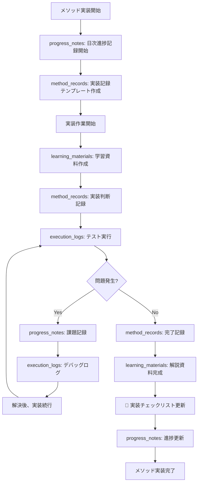
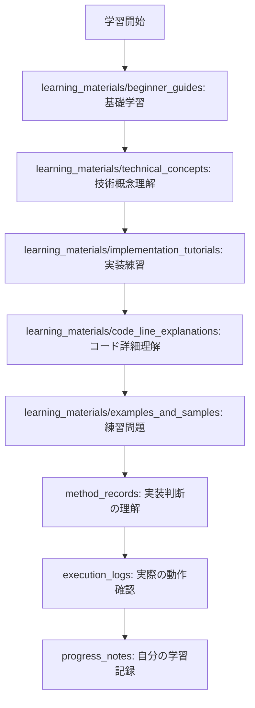

# 実装記録 (Implementation Records)

このディレクトリは、Andonプロジェクトのクラスメソッド実装に関する全ての記録を体系的に整理・保存する場所です。

## 📁 フォルダー構成

```
implementation_records/
├── 📚 learning_materials/    # C#初学者向け学習資料
├── 📋 method_records/        # 各メソッドの実装記録
├── 📊 execution_logs/        # 実行ログ・テスト結果
└── 📝 progress_notes/        # 進捗メモ・課題点
```

## 🎯 各フォルダーの詳細

### 📚 **learning_materials/**
**目的**: C#初学者が各メソッド実装を通して体系的に学習できる教材

**内容**:
- **beginner_guides/**: C#基礎からプロジェクト固有技術までの段階別ガイド
- **code_line_explanations/**: 実装コードの1行ずつ詳細解説
- **technical_concepts/**: SLMP、非同期処理、DIなど技術概念の解説
- **implementation_tutorials/**: Step-by-Stepの実装手順書
- **examples_and_samples/**: 練習問題、サンプルコード、チャレンジ課題

### 📋 **method_records/**
**目的**: 各メソッド実装の判断根拠、試行錯誤、パフォーマンス測定を詳細記録

**内容**:
- 実装方法の選択理由
- 試行錯誤の履歴と比較
- パフォーマンス測定結果
- 発生した問題と解決策
- 技術選択の根拠

### 📊 **execution_logs/**
**目的**: 実装したメソッドの実行結果、テスト結果、デバッグ情報の保存

**内容**:
- 単体テスト・統合テスト結果
- パフォーマンステスト結果
- 実行時ログとデバッグ情報
- エラーログと対処記録
- 継続的な品質監視データ

### 📝 **progress_notes/**
**目的**: 実装進捗の管理、課題追跡、アイデア蓄積、振り返り

**内容**:
- 日次・週次の進捗記録
- 課題・問題の追跡管理
- 改善アイデアとバックログ
- マイルストーン達成記録
- 定期的な振り返りと改善計画

## 🔄 使用フロー

### メソッド実装時の記録フロー



### 学習者向けの活用フロー



## 📊 記録管理・活用指針

### 🎯 記録の品質維持
- **統一フォーマット**: テンプレートを活用した一貫性
- **適時記録**: リアルタイムでの詳細記録
- **客観的記録**: 事実ベースでの記録維持
- **継続的更新**: 情報の最新性保持
- **🚨 チェックリスト同期**: 学習資料完成時は必ず実装チェックリストを同時更新

### 🔍 効果的な活用
- **学習促進**: 段階的・体系的な知識習得
- **品質向上**: 過去の経験を活かした改善
- **効率化**: ベストプラクティスの蓄積・共有
- **振り返り**: 定期的な進捗・課題の見直し

### 📈 継続的改善
- **定期レビュー**: 月次での記録内容見直し
- **プロセス改善**: より効果的な記録方法の模索
- **ツール活用**: 自動化・効率化ツールの導入
- **知識共有**: チーム内での経験・知識の共有

## 🚀 今後の展開

### Phase 1: 基盤構築 (完了)
- ✅ フォルダー構造の作成
- ✅ テンプレート・ガイドラインの整備
- ✅ 学習資料フレームワークの構築

### Phase 2: 実装記録 (進行予定)
- 🔄 各メソッド実装の詳細記録
- 🔄 学習資料の段階的作成
- 🔄 テスト結果・ログの蓄積

### Phase 3: 最適化・活用 (将来)
- 🔮 記録分析による傾向把握
- 🔮 自動化ツールの導入
- 🔮 ナレッジベースとしての活用
- 🔮 他プロジェクトへの応用

---

このディレクトリ構造を活用することで、単なる実装作業を**体系的な学習**と**継続的な改善**に変え、C#スキルの向上とプロジェクト品質の向上を同時に実現します。